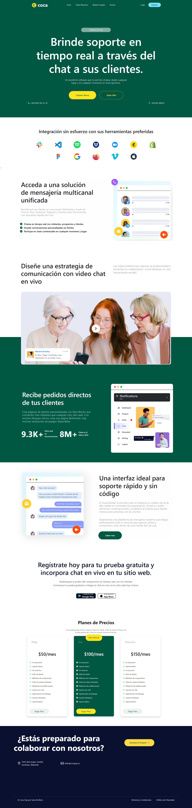

# Caso 2 - Prácticas  

Este repositorio contiene el código fuente de la página web basada en un mockup.  
El proyecto utiliza **Bootstrap** para la maquetación y diseño responsivo.  
## Requisitos Previos
Para visualizar y modificar el proyecto, asegúrate de tener instalados los siguientes programas:
- Un navegador web moderno (Google Chrome, Firefox, Edge, etc.).
- Un editor de código (VS Code, Sublime Text, Atom, etc.).
- Un servidor local opcional (XAMPP, WAMP o Live Server en VS Code) para pruebas.
##  Cómo Ejecutar el Proyecto
  1. **Clonar el repositorio**  
   ```bash
   git clone https://github.com/CristhofA/web-mockup.git
   ```

## Tecnologías Utilizadas  
- **HTML5**: Estructura de la página.  
- **CSS3**: Estilos personalizados.  
- **Bootstrap 5**: Diseño responsivo y componentes.  
- **Bootstrap Icons**: Iconos para la interfaz.  
- **JavaScript**: Para la animación.  
## Estructura del Proyecto  

- 📂 Proyecto-COCA
- ├── 📂 img              # Imágenes utilizadas en el sitio
- ├── 📂 mockup           # Referencia del diseño
- ├── styles.css          # Hoja de estilos principal
- ├── script.js           # Archivo de funcionalidades dinámicas
- ├── index.html          # Página principal
- ├── README.md           # Documentación del proyecto

## Captura de resultado  
  

## Captura de mockup  
  

